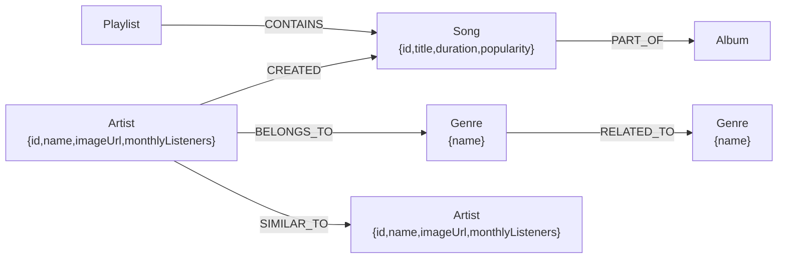

# Wexa AI — CongoDB Explorer

A full-stack **graph database explorer** for a synthetic music universe. The project models artists, songs, genres, albums, and playlists as nodes in **CognoDB** (backed by open Cypher over the Bolt protocol) and exposes them through a Spring Boot REST API. A React + Vite frontend lets users search artists, browse graph networks and discographies, find the shortest path between two tracks, and discover playlists that share overlapping songs.

---

> **⚠️ Deployment Disclaimer:** The backend service is hosted on Render's free tier. Render automatically spins down web services that remain idle after a period of inactivity. Because of this policy, the initial API request may experience a delay of 30–50 seconds while the server spins back up.

 - Live demo: https://wexaai-frontend.onrender.com/
 - Video demo: https://drive.google.com/file/d/1wwPgzuugwtOGG5vrW0TpbBq0QL5uhUGc/view?usp=sharing

## Why a Graph Database?

Relational databases (SQL) store data in rigid tables with foreign key columns. While effective for simple parent-child relationships, answering real-world music discovery questions in a relational schema quickly breaks down:
1. **Expensive Multi-Table Joins:** Finding similar artists through a 2-hop network (`Artist -> BELONGS_TO -> Genre <- BELONGS_TO <- Artist -> SIMILAR_TO -> Artist`) requires 4 to 6 self-joins across tables with complex intermediate indexing, degrading performance exponentially as depth increases.
2. **Arbitrary Depth Pathfinding:** Determining the shortest path of connections between two completely unrelated songs (e.g., tracking how `Loud Lights` connects to `Infinite Soul` through shared artist collaborations and playlist memberships) requires recursive Common Table Expressions (CTEs) in SQL that are notoriously slow, difficult to maintain, and awkward to write.
3. **Graph-Native Operations:** CognoDB (Neo4j-compatible) natively stores relationships as first-class citizens pointers in memory (`[r:SIMILAR_TO]`, `[r:CONTAINS]`), allowing sub-millisecond traversal speeds regardless of database size. Relationships are traversed directly rather than computed at runtime via foreign-key lookups.

---

## CognoDB Cloud Setup

This application uses **CognoDB Cloud** as its managed graph database tier. Follow these steps to provision and connect your instance:

1. **Create an Account:** Go to [console.cognodb.com/signup](https://console.cognodb.com/signup) and sign up for a free account (no credit card required)[cite: 12].
2. **Provision a Free Instance:** From the CognoDB Console, create a free (`c0`) instance and pick your preferred region. It provisions in under a minute[cite: 12].
3. **Save Your Credentials:** Upon provisioning, you will receive:
   - A connection URI of the form `bolt+s://<instance-id>.databases.cognodb.cloud`[cite: 12]
   - A generated password for the username `cognodb`[cite: 12]. 
   *(Note: The password is shown only once—copy or download it immediately and keep it secure[cite: 12]).*
4. **Configure Environment Variables:** Never commit secrets to version control[cite: 12]. Set the following environment variables locally or in your deployment provider dashboard:
```bash
   export CognoDB_URI="bolt+s://<instance-id>.databases.cognodb.cloud"
   export CognoDB_USERNAME="cognodb"
   export CognoDB_PASSWORD="your_generated_password"

```

---

## DB Architecture



## UI Screenshots


| Layer | Technology |
| --- | --- |
| Frontend | React 19, Vite 8, React Router 7, React Flow 11 |
| Backend | Java 21, Spring Boot 4.0.7, Spring MVC, Neo4j Java Driver, Lombok |
| Database | CognoDB Cloud (Bolt 5.0-5.4), auto-seeded at startup from CSVs |
| Tooling | Maven (backend), npm (frontend), Docker Compose, Render (deploy) |

---

## Graph Data Model

### Nodes

| Label | Key property | Other properties |
| --- | --- | --- |
| `Artist` | `id` | `name`, `imageUrl`, `monthlyListeners` |
| `Song` | `id` | `title`, `duration`, `popularity` |
| `Genre` | `name` | `name` |
| `Album` | `id` | `name` |
| `Playlist` | `id` | `name`, `mood` |

### Relationships

| Relationship | Direction | Meaning |
| --- | --- | --- |
| `CREATED` | `Artist` → `Song` | Artist created the song |
| `BELONGS_TO` | `Artist` → `Genre` | Artist belongs to the genre |
| `SIMILAR_TO` | `Artist` → `Artist` | Artists are similar |
| `PART_OF` | `Song` → `Album` | Song appears on the album |
| `CONTAINS` | `Playlist` → `Song` | Playlist contains the song |
| `RELATED_TO` | `Genre` → `Genre` | Genres are related |

---

## Repository Layout

```
├── backend/                  # Spring Boot REST API
│   ├── src/main/java/com/wexa/backend/
│   │   ├── config/          # CognoDB/Neo4j driver bean configuration
│   │   ├── controller/      # Artist, Songs, Playlist, Health controllers
│   │   ├── dto/             # Response records
│   │   └── service/         # Cypher queries + startup seed loader
│   └── src/main/resources/
│       ├── application.properties
│       └── data/            # CSV seed data
├── frontend/                 # React SPA (Vite)
│   └── src/
│       ├── pages/           # search, artist, pathfinder, playlistdetails
│       └── components/      # header & navigation
├── data/                    # Source CSV seed files
├── queries.cypher           # Reference Cypher snippets
├── docker-compose.yml       # Local stack configuration
├── render.yaml              # Render.com deployment config
└── seed.sh                  # Bash utility for cloud seeding

```

---

## Backend API & Main Queries Explained

Base URL: `http://localhost:8080` (or your hosted backend URL)

| Method | Endpoint | Description |
| --- | --- | --- |
| GET | `/api/health` | DB connectivity status and total node count |
| GET | `/api/artists?name={query}` | Case-insensitive fuzzy search of artists |
| GET | `/api/artists/{id}` | Artist details (genres, discography) by ID |
| GET | `/api/artists/{id}/recommendations` | 2-hop similar-artist recommendations (top 10) |
| GET | `/api/songs/path?source=&target=` | Shortest path between two song titles (max 10 hops) |
| GET | `/api/playlist/{name}/similar` | Playlists sharing songs with the given playlist (top 8) |
| GET | `/api/playlist/{name}/songs` | Song tracklist of a playlist |

### Key Cypher Queries Explained

1. **Shortest Path Traversal (`/api/songs/path`)**:
Uses Neo4j's built-in `shortestPath` function to traverse up to 10 hops across mixed node types (songs, artists, playlists, albums):
```cypher
MATCH (source:Song {title: $sourceTitle}), (target:Song {title:$targetTitle})
MATCH p = shortestPath((source)-[*..10]-(target))
RETURN [n IN nodes(p) | coalesce(n.title, n.name, labels(n)[0] + ': ' + coalesce(n.title, n.name))] AS path

```


*Why relational fails:* In SQL, finding arbitrary paths between records across multiple junction tables requires complex recursive CTEs that timeout on dense graphs.
2. **2-Hop Recommendations (`/api/artists/{id}/recommendations`)**:
Traverses from an artist, through shared genres or similar artists, outward to recommend unlinked artists:
```cypher
MATCH (a:Artist {id: $artistId})-[:BELONGS_TO]->(g:Genre)<-[:BELONGS_TO]-(rec:Artist)
WHERE a <> rec
RETURN rec, count(g) AS sharedGenres ORDER BY sharedGenres DESC LIMIT 10

```


---

## Frontend Pages & UI

| Route | Page | Purpose |
| --- | --- | --- |
| `/` | Home | Search bar + quick graph-traversal shortcuts |
| `/search?q={query}` | Search | Artist search results from the graph |
| `/artist/:id` | Artist Details | Node data, similar-artist network, discography |
| `/path?source=&target=` | Pathfinder | Interactive React Flow visualization of a shortest path |
| `/playlists/:name/similar` | Playlist Details | Tracklist + overlapping playlists by shared songs |

---

## Getting Started

### Prerequisites

* JDK 21
* Node.js (20+) and npm
* Maven (or bundled `./mvnw`)

### Local Development

1. **Configure Environment Variables:**
Create a `.env` file in your root/backend directory or export your CognoDB Cloud variables:
```bash
export CognoDB_URI="bolt+s://<instance-id>.databases.cognodb.cloud"
export CognoDB_USERNAME="cognodb"
export CognoDB_PASSWORD="your_generated_password"

```


2. **Run the Backend:**
```bash
cd backend
./mvnw spring-boot:run

```


*On startup, `SeedDataLoader` automatically verifies database connection and loads CSV seed data if empty.*
3. **Run the Frontend:**
```bash
cd frontend
npm install
npm run dev

```
Open `http://localhost:5173`.

---


