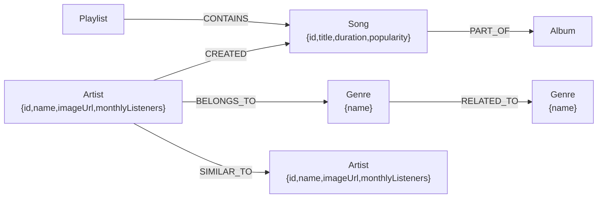

# Wexa AI — Music Graph Ecosystem

A full-stack **graph database explorer** for a synthetic music universe. The project models artists, songs, genres, albums, and playlists as nodes in a Neo4j (branded **CongoDB**) graph and exposes them through a Spring Boot REST API. A React + Vite frontend lets you search artists, browse their graph network and discography, find the shortest path between two songs, and discover playlists that share tracks.

## DB Architecture



| Layer    | Technology                                                        |
| -------- | ----------------------------------------------------------------- |
| Frontend | React 19, Vite 8, React Router 7, React Flow 11                   |
| Backend  | Java 21, Spring Boot 4.0.7, Spring MVC, Neo4j Java Driver, Lombok |
| Database | Neo4j (dockerized), auto-seeded at startup from bundled CSV data  |
| Tooling  | Maven (backend), npm (frontend), Docker Compose, Render (deploy)  |

## Graph Data Model

### Nodes

| Label      | Key property | Other properties           |
| ---------- | ------------ | -------------------------- |
| `Artist`   | `artistId`   | `name`, `monthlyListeners` |
| `Song`     | `songId`     | `title`, `popularity`      |
| `Genre`    | `genreId`    | `name`                     |
| `Album`    | `albumId`    | `name`                     |
| `Playlist` | `playlistId` | `name`, `mood`             |

### Relationships

| Relationship | Direction           | Meaning                     |
| ------------ | ------------------- | --------------------------- |
| `CREATED`    | `Artist` → `Song`   | Artist created the song     |
| `BELONGS_TO` | `Artist` → `Genre`  | Artist belongs to the genre |
| `SIMILAR_TO` | `Artist` → `Artist` | Artists are similar         |
| `PART_OF`    | `Song` → `Album`    | Song appears on the album   |
| `CONTAINS`   | `Playlist` → `Song` | Playlist contains the song  |
| `RELATED_TO` | `Genre` → `Genre`   | Genres are related          |

The seed dataset ships with 100 artists, 100 songs, 100 genres, 100 albums, and 100 playlists.

## Repository Layout

```
├── backend/                 # Spring Boot REST API
│   ├── src/main/java/com/wexa/backend/
│   │   ├── config/          # Neo4j driver bean
│   │   ├── controller/      # Artist, Songs, Playlist, Health controllers
│   │   ├── dto/             # Response records
│   │   └── service/         # Cypher queries + startup seed loader
│   └── src/main/resources/
│       ├── application.properties
│       └── data/            # CSV seed data (same as ./data)
├── frontend/                # React SPA (Vite)
│   └── src/
│       ├── pages/           # search, artist, pathfinder, playlistdetails
│       └── components/      # header
├── data/                    # Source CSV seed files
├── seed/seed.cypher         # Self-contained Cypher seed script
├── generate_*.py            # Data pipeline generator scripts
├── queries.cypher           # Reference Cypher snippets
├── Music_Graph_Ecosystem.xlsx  # Multi-tab Excel export of the data
├── docker-compose.yml       # Local stack: backend + nginx frontend + neo4j
├── render.yaml              # Render.com deployment config
└── seed.sh                  # Regenerates seed/seed.cypher from CSVs
```

## Backend API

Base URL: `http://localhost:8080`

| Method | Endpoint                              | Description                                             |
| ------ | ------------------------------------- | ------------------------------------------------------- |
| GET    | `/api/health`                         | DB connectivity status and total node count             |
| GET    | `/api/artists?name={query}`           | Case-insensitive fuzzy search of artists                |
| GET    | `/api/artists/{artistId}`             | Artist details (genres, discography) by ID              |
| GET    | `/api/artists/{name}/recommendations` | 2-hop similar-artist recommendations (top 10)           |
| GET    | `/api/songs/path?source=&target=`     | Shortest path between two song titles (max 10 hops)     |
| GET    | `/api/playlist/{name}/similar`        | Playlists sharing songs with the given playlist (top 8) |
| GET    | `/api/playlist/{name}/songs`          | Song tracklist of a playlist                            |

All endpoints allow cross-origin requests (`*`). `GET /api/artists/{name}/recommendations` returns `204 No Content` when nothing is found.

## Frontend Pages

| Route                      | Page             | Purpose                                                 |
| -------------------------- | ---------------- | ------------------------------------------------------- |
| `/`                        | Home             | Search bar + quick graph-traversal shortcuts            |
| `/search?q={query}`        | Search           | Artist search results from the graph                    |
| `/artist/:id`              | Artist Details   | Node data, similar-artist network, discography          |
| `/path?source=&target=`    | Pathfinder       | Interactive React Flow visualization of a shortest path |
| `/playlists/:name/similar` | Playlist Details | Tracklist + overlapping playlists by shared songs       |

## Getting Started

### Prerequisites

- JDK 21
- Node.js (20+) and npm
- Maven (or use the bundled `mvnw`)
- Docker (optional, for a containerized stack)
- Python 3 (only needed to regenerate seed data)

### Local development

**1. Start Neo4j**

With Docker:

```bash
docker run --name neo4j \
  -p 7474:7474 -p 7687:7687 \
  -e NEO4J_AUTH=neo4j/password123 \
  neo4j:latest
```

The backend connects to `neo4j://localhost:7687` with `neo4j`/`password123` by default (see `backend/src/main/resources/application.properties`).

**2. Run the backend**

```bash
cd backend
./mvnw spring-boot:run
```

On startup, `SeedDataLoader` reads the CSVs in `backend/src/main/resources/data/` and seeds the graph automatically (disable with `app.seed.enabled=false`).

**3. Run the frontend**

```bash
cd frontend
npm install
npm run dev
```

Open `http://localhost:5173`. The frontend calls `http://localhost:8080` by default; override with `VITE_API_URL`.

### Docker Compose (full stack)

```bash
docker compose up --build
```

- Frontend (nginx): `http://localhost:3000`
- Backend API: `http://localhost:8080`
- Neo4j Browser: `http://localhost:7474`

Set `CognoDB_URI`, `CognoDB_USERNAME`, and `CognoDB_PASSWORD` environment variables before running (the compose file wires them into the backend).

## Seeding the Database

The graph can be populated three ways:

1. **Automatic (default)** — `SeedDataLoader` imports the bundled CSVs from the classpath on every backend startup.
2. **Self-contained Cypher script** — run `seed/seed.cypher` (generated by `generate_seed_cypher.py`) in Neo4j Browser/Studio. It uses `MERGE` throughout, so it is idempotent and safe to re-run.
3. **Regenerate from scratch** — run the Python pipeline to recreate all data:

```bash
# 1. Regenerate CSVs into ./data and the Excel export
python generate_graph_data.py.py
python generate_playlists.py
python generate_seed_cypher.py

# or, if you regenerate CSVs, the bash wrapper regenerates only the Cypher:
./seed.sh
```

## Deployment

### Render.com

`render.yaml` provisions two services:

- **backend** — a Docker web service built from `backend/Dockerfile`, health-checked at `/api/health`, with `CognoDB_URI`, `CognoDB_USERNAME`, and `CognoDB_PASSWORD` passed as environment variables.
- **frontend** — a static site built from `frontend/dist` (`npm ci && npm run build`).

## Cypher Reference

The key traversals behind the API live in `queries.cypher`:

- Artist lookup, similar artists, and song recommendations
- Shortest-path discovery between artists (`MATCH p = SHORTESTPATH((a)-[*..15]-(b))`)

## License

This is a demonstration/learning project with procedurally generated data; no license is specified.
